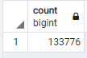
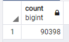
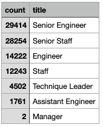
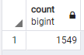
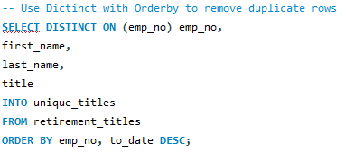
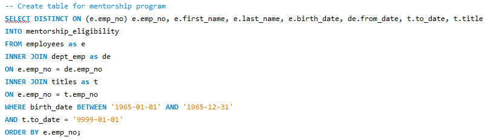

# Pewlett Hackard Analysis

## Overview of the Analysis

Pewlett Hackard is a bit behind in the database department, we were tasked to determining which employees will be retiring in the next few years and how many positions will need to be filled.
Majority number of baby boomers are ready to retire, we want to ensure that Pewlett Hackard is well prepared by setting up a mentorship program. The puspose of this analysis is to determine the number of retiring employees per title and identify the employees who are eligible to participate in the "silver tsunami" mentorship program.

## Results
### Based on our analysis:
- 133,776 employees born in the years 1952 through 1955. This number is inflated since employees may appear in multiple rows due to change in job titles.

- 90,398 unique employees are eligible for retirement.

- title of employees who are eligible for retirement:

- 1,549 employees are eligible to participate in the "silver tsunami" mentorship program.

## Summary
Question 1: How many roles will need to be filled as the "silver tsunami" begins to make an impact?

90,398 roles will need to be filled.

Question 2: Are there enough qualified, retirement-ready employees in the departments to mentor the next generation of Pewlett Hackard employees?

Based on the analysis there are not enough qualified employees to mentor the next generation as there are only 1,549 employees, who are eligible to participate in the "silver tsunami" mentorship program

 

